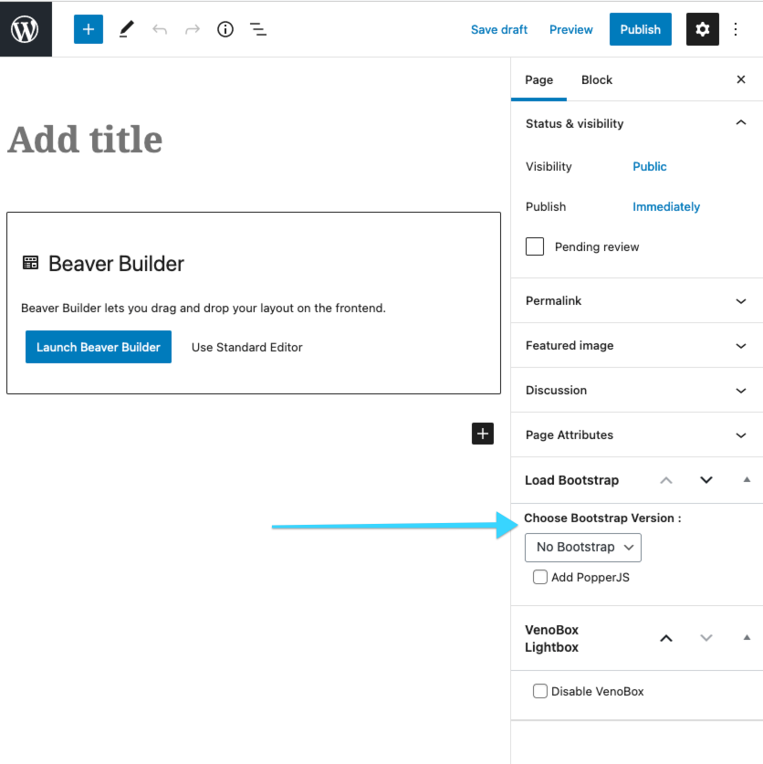

# Bootstrap Conditional

 - Author: Neil Gowran
 - Contributors: neilgee
 - Version: 1.3.0
 - Stable tag: 1.2.0
 - Tested up to: 5.6
 - Requires at least: 4.0
 - Plugin Name: Bootstrap Conditional
 - Plugin URI: https://github.com/neilgee/bootstrap-conditional
 - Description: Bootstrap Loader
 - Author URI: http://wpbeaches.com/
 - License: GPL-2.0+
 - License URI: http://www.gnu.org/licenses/gpl-2.0.txt
 - Donate link:

## Description

A WordPress plugin to conditionally load Bootstrap on selected posts or pages.

Choose which version:
 - Bootstrap version 3.4.1
 - Bootstrap version 4.6.0
 - Bootstrap version 5.0.x

##  Installation

This section describes how to install the plugin:

1. Upload the `bootstrap-conditional` folder to the `/wp-content/plugins/` directory
2. Activate the plugin through the 'Plugins' menu in WordPress
3. Dropdown option to enable Bootstrap appears in each post/page.

##  Usage

Click dropdown option to enable Bootstrap versions 3,4 or 5 on certain post/pages.
Loads both Bootstrap Javascript and CSS.

Use in Classic Editor or GB.

If using the Beaver Theme, best usage is to set the theme's customizer setting 'General > Layout > CSS framework' to Minimal Bootstrap 3 or 4, then use the Bootstrap metabox on each post/page needed to run the full framework.

 

### Changelog

1.3.1 - 09/03/21
- Add check for Bootstrap variable to be equal to none

1.3.0 - 07/03/21
- Add Bootstrap version 5 as option
- Include JS for tooltips and popovers for BS5 when PopperJS is selected
- Update PopperJS to 1.16.1 for BS 3 & 4

1.2.0 - 21/02/21
- Add different Bootstrap versions 3,4 as options

1.1.0 - 20/02/21
- Add PopperJS Option
- Dequeue minimal base CSS from Beaver Builder theme on pages/posts set to load full Bootstrap

1.0.0 - 15/02/21
- Initial release.

